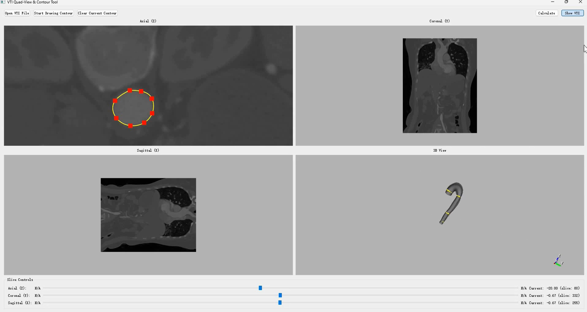

# Semi-Automatic Medical Image Segmentation Demo

This repository contains a demo application for the semi-automatic segmentation of 3D medical images. It provides a user interface built with PyQt5 and VTK to load 3D medical images (`.vti`), allow users to manually draw contours on 2D slices, and visualize pre-computed 3D geometric results (`.vtp`) generated by a diffusion model.

## 🎥 Demonstration

The following video demonstrates the main workflow of the application, including loading VTI data, drawing a contour in the Axial view, simulating the calculation, and loading the final VTP 3D models step-by-step. Click the image to watch the video:

[](demo_video.mp4)
-----

## 📝 Overview

This tool serves as an early-stage prototype for an interactive segmentation workflow. The current version does not have a live connection to the diffusion model. Instead, it simulates the calculation process and loads a series of pre-existing `.vtp` files to demonstrate the potential step-by-step output of the model.

The primary goal is to provide a visual front-end to guide and interact with advanced generative models for medical imaging tasks.

## ✨ Key Features

  * **VTI File Loading**: Opens and displays 3D medical image data in the `.vti` format.
  * **Quad-View Display**: Simultaneously shows Axial, Sagittal, Coronal, and a 3D view of the image data.
  * **Interactive Slicing**: Users can scroll through slices in all three 2D views.
  * **Contour Drawing**: Ability to draw closed-loop contours on the 2D axial slice to specify a region of interest.
  * **3D Visualization**: Renders the drawn contours and pre-computed 3D models in the 3D view.
  * **Simulated Calculation**: A "Calculate" button simulates a time-intensive process and then loads the next-stage 3D geometry from the `vtp` folder.

## ⚠️ Project Status

**Prototype:** This is an early-stage demonstration and not a production-ready tool. The core UI functionality is in place, but the direct, real-time integration with the diffusion model is the key objective for future development.

## 💻 Technology Stack

  * **Python 3**
  * **PyQt5**: For the graphical user interface (GUI).
  * **VTK (The Visualization Toolkit)**: For all 2D/3D rendering and medical imaging data handling.


## 🚀 How to Run

1.  **Organize your data files.** Before running the script, ensure your directory structure is as follows:

    ```
    your-repo-name/
    ├── vti/
    │   └── your_medical_image.vti
    ├── vtp/
    │   ├── stage1_result.vtp
    │   ├── stage2_result.vtp
    │   └── ...
    ├── screenshot.png
    ├── demo_video.mp4
    ├── main.py
    └── README.md
    ```

2.  **Update file paths in the script.** The current version of `main.py` contains hardcoded paths to the `.vtp` files. You **must** update the `self.vtp_file_list` in the `__init__` method to point to the correct paths of your VTP files.

    ```python
    # Find this list in main.py and modify it
    self.vtp_file_list = [
        "vtp/stage1_result.vtp",
        "vtp/stage2_result.vtp",
        # ... add all your other vtp files here
    ]
    ```

3.  **Run the application:**

    ```bash
    python main.py
    ```

## 🗺️ Future Work / Roadmap

The primary goal for the next phase of this project is to bridge the gap between the UI and the generative model.

  * **Direct Integration with Diffusion Model**: Replace the placeholder "Calculate" function and the pre-computed VTP files with a live connection to the lab's diffusion model. This will allow for dynamic, real-time segmentation calculations based on the user-drawn contours.
  * **Contour Editing**: Implement features to allow modification of existing contour points.
  * **General Usability Improvements**: Refine the user interface and add more robust error handling.

## ✍️ Authorship

All code in this repository was written independently by the author.

## 📄 License

This project is licensed under the MIT License.